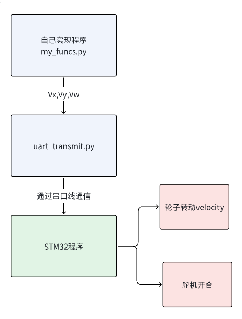

# RM26_DREDGE_forNew
给新生用校内赛底层代码仓库
组委会提供代码介绍
- 本次比赛为降低难度，主要的编程都在上层机构（MaixCam）上实现，STM32中提前烧录好能驱动轮子的代码，同学们只需要正确接线即可。
- 为了鼓励同学自主学习，zip中附上下板源代码，需要提升性能的同学可以修改并烧录自己的代码到下板。
附上zip，内包含：
- stm32驱动轮子程序
- MaixCam文件夹中包含双板串口通信程序，需要把他当成一个API，并在自己的代码中实现Vx,Vy,Vw的计算，再使用改函数发送给下板，从而驱动轮子转动。
